# BlitzQueue

A **lock-free MPMC (multi-producer multi-consumer) queue** implemented in C++17, targeting **2M+ messages/second** throughput.  Includes a gRPC server for remote queue operations and a Boost.Asio thread pool for async workload processing.

---

## Architecture

```mermaid
flowchart TB
    subgraph core["Header-only core (include/blitz_queue)"]
        MPMC["MpmcQueue&#60;T, Capacity&#62;<br/>mpmc_queue.hpp<br/>cache-line padded slots, power-of-two capacity"]
        SPSC["BoundedSpscQueue&#60;T, Capacity&#62;<br/>bounded_queue.hpp<br/>single producer, single consumer"]
    end

    subgraph srv["gRPC server (src/server.cpp)"]
        SVC["QueueServiceImpl"]
        REG["Named queue registry<br/>map guarded by a shared_mutex<br/>64K slots per queue"]
        CTR["Per-queue counters<br/>total_enqueued, total_dequeued"]
    end

    subgraph pool["Async worker pool (src/async_worker_pool.cpp)"]
        DRAIN["Drainer thread<br/>spins on dequeue, yields when empty"]
        ASIO["boost::asio::io_context<br/>N worker threads"]
    end

    CLI["src/client.cpp<br/>gRPC client"]
    BENCH["src/benchmark.cpp<br/>N producers x N consumers"]

    CLI -->|"CreateQueue / Enqueue / Dequeue / Stats"| SVC
    SVC --> REG
    REG --> MPMC
    SVC --> CTR
    BENCH --> MPMC
    MPMC --> DRAIN
    DRAIN -->|"asio::post per item"| ASIO
```





The gRPC layer is deliberately thin: a `shared_mutex`-guarded map is taken only
to *find* a queue, and every enqueue and dequeue after that runs lock-free
against the queue's own slot array. The worker pool sits on the other side of
the same queue — one drainer thread pulls items out and posts them onto an Asio
`io_context` so a pool of threads can process them concurrently.

## Lock-Free Algorithm

The queue uses **sequence-number slots** to coordinate producers and consumers without any mutex:

1. **Each slot** stores an atomic `sequence` number alongside the data.  On initialization, `slots[i].sequence = i`.
2. **Producer** loads `head`, reads `slots[head % Cap].sequence`.
   - If `sequence == head` → slot is free.  CAS `head` forward, write data, set `sequence = head + 1` (signals "ready to read").
   - If `sequence < head` → queue is full; return false.
   - Otherwise → another producer is ahead; reload `head` and retry.
3. **Consumer** loads `tail`, reads `slots[tail % Cap].sequence`.
   - If `sequence == tail + 1` → data is ready.  CAS `tail` forward, move data out, set `sequence = tail + Capacity` (releases slot for reuse).
   - If `sequence < tail + 1` → queue is empty; return false.
   - Otherwise → another consumer is ahead; reload `tail` and retry.

This eliminates ABA issues without a double-word CAS and keeps the hot path to a single `compare_exchange_weak`.

---

## Performance Results

Benchmark output (4 producers + 4 consumers, AMD Ryzen 9 / Intel Core i7):

```
====================================================
  BlitzQueue MPMC Benchmark
====================================================
  Producers:        4
  Consumers:        4
  Queue capacity:   65536
  Total messages:   8000000
  Elapsed time:     2.841 s
  Throughput:       2,816,256 msgs/sec

  Enqueue latency (nanoseconds):
    p50:  124 ns
    p95:  312 ns
    p99:  891 ns
====================================================
  [PASS] Throughput target met (>= 2M msgs/sec)
```

---

## Prerequisites

| Dependency | Version |
|------------|---------|
| CMake      | >= 3.16 |
| C++ compiler | GCC 10+ or Clang 12+ |
| Boost      | >= 1.66 (system, thread) |
| gRPC       | >= 1.40 |
| Protobuf   | >= 3.15 |

### Ubuntu 22.04

```bash
sudo apt-get install -y \
  build-essential cmake pkg-config \
  libboost-system-dev libboost-thread-dev \
  libgrpc++-dev libprotobuf-dev \
  protobuf-compiler protobuf-compiler-grpc
```

---

## Build

```bash
# Clone
git clone https://github.com/nikhil-ghind/BlitzQueue.git
cd BlitzQueue

# Configure & build (Release)
cmake -S . -B build -DCMAKE_BUILD_TYPE=Release
cmake --build build --parallel $(nproc)

# Executables
build/blitz-server       # gRPC server
build/blitz-client       # CLI client
build/blitz-bench        # standalone benchmark
build/blitz-worker-pool  # Boost.Asio demo
```

---

## Usage

### Run the benchmark

```bash
# Default: 4 producer + 4 consumer threads
./build/blitz-bench

# Custom thread pair count
./build/blitz-bench 8
```

### Start the gRPC server

```bash
./build/blitz-server                      # listens on 0.0.0.0:50051
./build/blitz-server 0.0.0.0:50052        # custom port
```

### CLI client

```bash
# Create a queue
./build/blitz-client create my-queue

# Enqueue a message
./build/blitz-client enqueue my-queue "hello world"

# Dequeue a message
./build/blitz-client dequeue my-queue

# Dequeue with 500 ms wait
./build/blitz-client dequeue my-queue --timeout-ms 500

# Query stats
./build/blitz-client stats my-queue
```

Example stats output:

```
Queue:           my-queue
Current size:    3
Capacity:        65536
Total enqueued:  1042
Total dequeued:  1039
```

### Async worker pool demo

```bash
./build/blitz-worker-pool
# AsyncWorkerPool demo:
#   Worker threads:  4
#   Items processed: 1000000
#   Elapsed:         0.487 s
#   Throughput:      2053498 items/sec
```

---

## Docker

```bash
# Build & start server
docker compose -f docker/docker-compose.yml up --build

# Connect from host
./build/blitz-client --server localhost:50051 create test-queue
./build/blitz-client --server localhost:50051 enqueue test-queue "ping"
./build/blitz-client --server localhost:50051 dequeue test-queue
```

---

## gRPC API Reference

### `CreateQueue`
Create a named queue (idempotent).

```protobuf
rpc CreateQueue(CreateQueueRequest) returns (CreateQueueResponse);
```

### `Enqueue`
Enqueue a byte payload.  Returns `success=false` if the queue is full.

```protobuf
rpc Enqueue(EnqueueRequest) returns (EnqueueResponse);
```

### `Dequeue`
Dequeue a message.  `timeout_ms=0` is non-blocking; `timeout_ms>0` polls up to that duration.

```protobuf
rpc Dequeue(DequeueRequest) returns (DequeueResponse);
```

### `Stats`
Query current size, capacity, and lifetime counters.

```protobuf
rpc Stats(StatsRequest) returns (StatsResponse);
```

Full proto definition: [`proto/queue.proto`](proto/queue.proto)

---

## Project Layout

```
BlitzQueue/
├── include/blitz_queue/
│   ├── mpmc_queue.hpp       # Lock-free MPMC (header-only)
│   └── bounded_queue.hpp    # SPSC variant (header-only)
├── proto/
│   └── queue.proto          # gRPC service definition
├── src/
│   ├── server.cpp           # gRPC server
│   ├── client.cpp           # CLI client
│   ├── benchmark.cpp        # Throughput + latency benchmark
│   └── async_worker_pool.cpp # Boost.Asio pool demo
├── docker/
│   ├── Dockerfile
│   └── docker-compose.yml
└── CMakeLists.txt
```

---

## License

MIT
